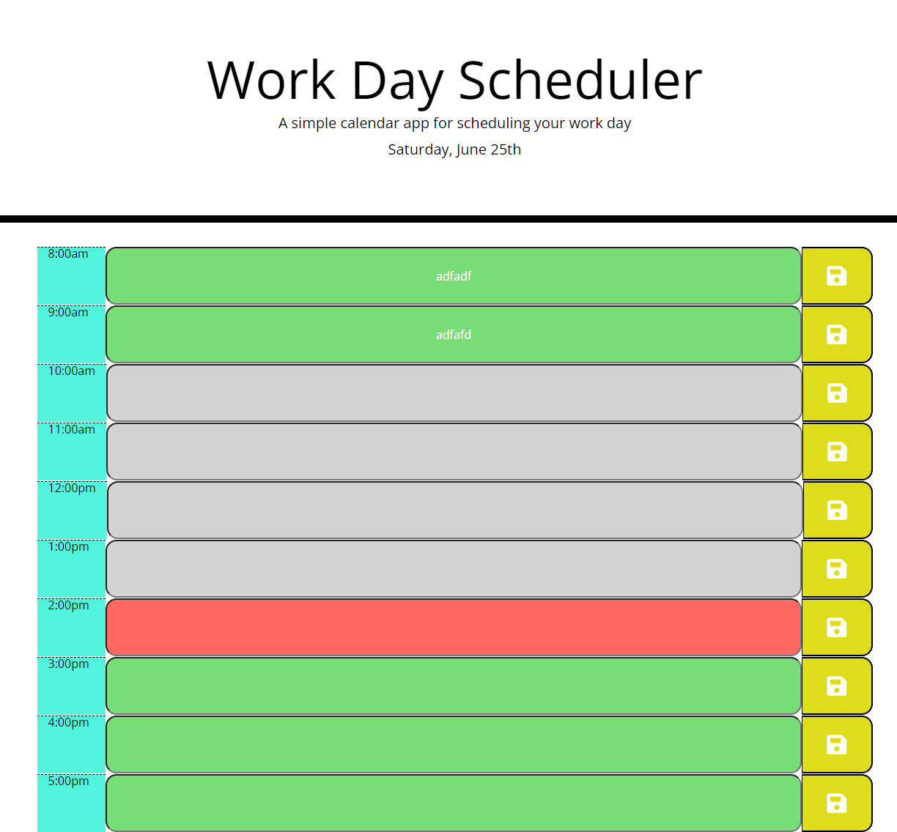

Project Title: Work-Day-Scheduler

Project Description: This interactive application allows the user to track their daily schedule. At the top of the application will be the current date and below will be time blocks between 8am-5pm. Each hour block of time will be color coted; past hours are grey, current hour is red and future hours are green. The user can type in the block time with their Todo's and it will save even when the page is refreshed.  
 
 Link: https://rpape3.github.io/Work-Day-Scheduler/
 

Screenshots: 

